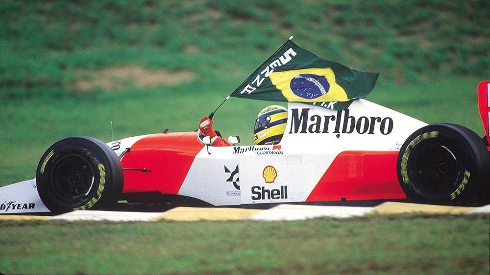

<h2>Tribute Page - freeCodeCamp</h2>

This is the 1st of 5 projects required for **Responsive Design Certification**.

The honoree in the tribute was the Brazilian Formula One pilot **Ayrton Senna**.

